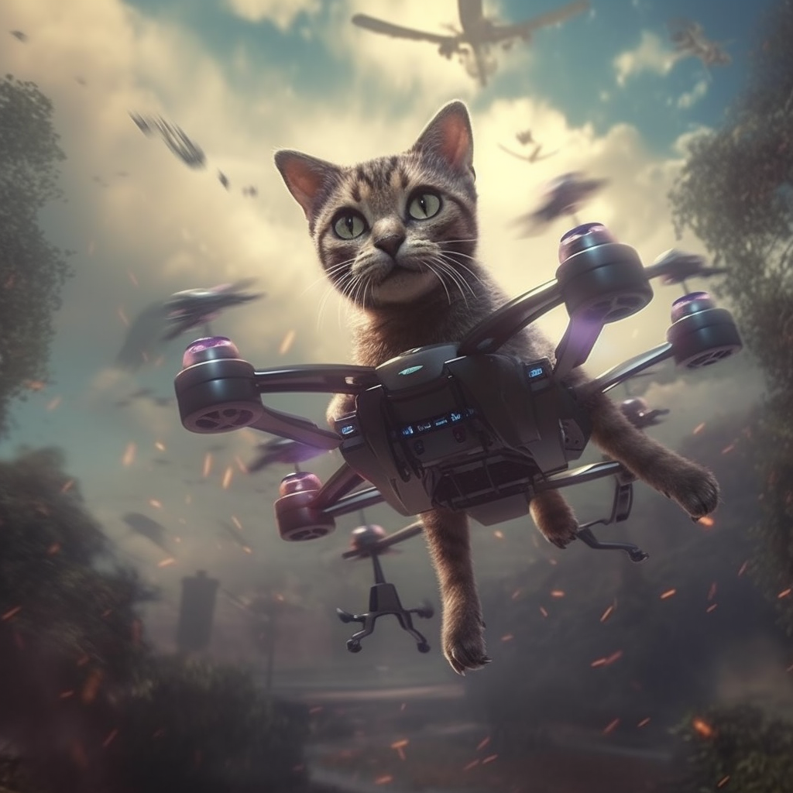
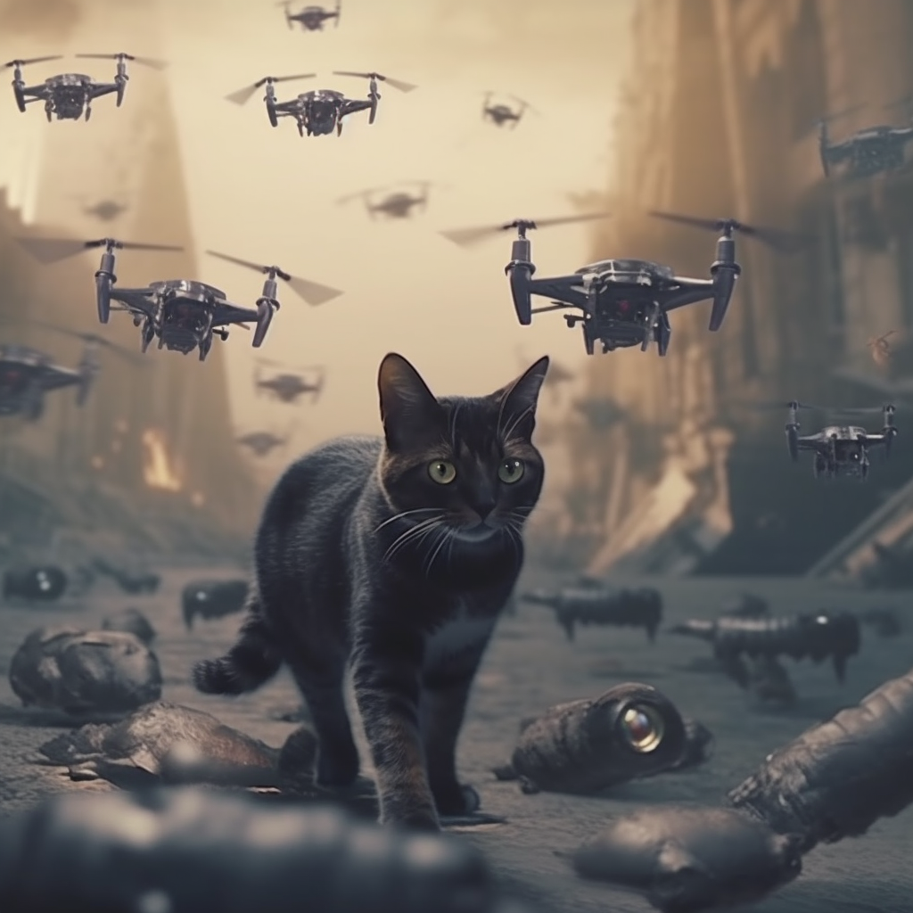

# CatTello

                                                              
Meet Cattello - the cat-chasing drone that's guaranteed to keep both you and your feline friends entertained. This project marries Tello drones and YOLOv4 technology to create an  interactive pet companion.

(PSA, this is my first python project, so the code is very basic...)

# Installation
Provide instructions on how to install and run your project

pip install djitellopy
pip install opencv-contrib-python

# Usage
Make sure Tello is connected to your wifi

Explain how to use your project. Include any necessary commands.

# Contributing
If you are open to contributions, explain how others can contribute to your project

# Credits
Acknowledge the sources that helped you in your project, including tutorials, videos, and OpenAI's GPT-4.

# License
Mention the license your project is under.

